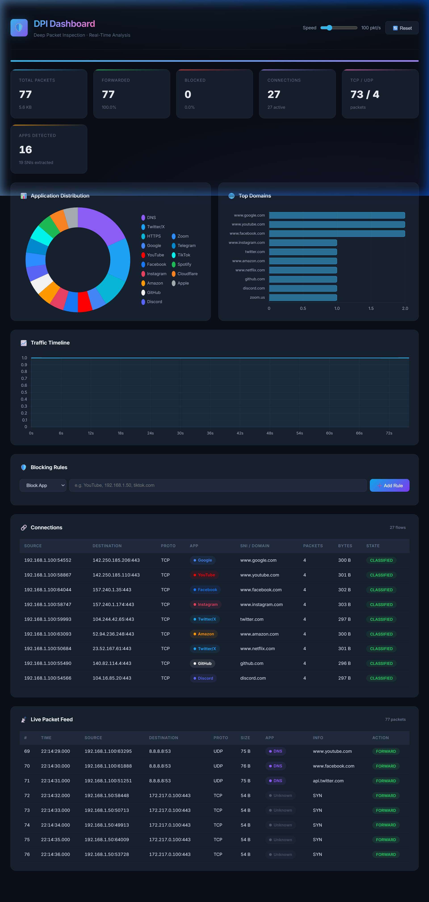

# 🛡️ DPI Dashboard — Real-Time Packet Analysis

A browser-based **Deep Packet Inspection** dashboard that parses `.pcap` files and visualizes network traffic in real time — app classification, connection tracking, SNI extraction, and interactive blocking rules.

**Zero dependencies. No build step. Just open in a browser.**



---

## ✨ Features

- **Drag-and-drop PCAP loading** — drop a `.pcap` file or use the built-in demo
- **Protocol Decoding** — Ethernet, IPv4, TCP, UDP header parsing
- **Deep Packet Inspection** — TLS SNI extraction, HTTP Host header, DNS query parsing
- **App Classification** — identifies 20+ apps: YouTube, Google, Facebook, Instagram, Netflix, Discord, GitHub, TikTok, Spotify, and more
- **Connection Tracking** — five-tuple flow table with TCP state machine (SYN → ESTABLISHED → FIN/RST)
- **Interactive Blocking Rules** — block by app name, IP address, or domain with instant re-analysis
- **Animated Processing** — packets stream through the engine in real time with adjustable speed
- **Charts** — app distribution donut, top domains bar chart, traffic timeline (powered by [Chart.js](https://www.chartjs.org/))
- **PCAP-ng Detection** — shows a clear error if you accidentally load a `.pcapng` file

---

## 🚀 Quick Start

### Option 1: Local Server (recommended)

```bash
cd dashboard
python -m http.server 8765
# Open http://localhost:8765
```

### Option 2: Live Demo

> **[🔗 Try it live on GitHub Pages →](https://<your-username>.github.io/<repo-name>/dashboard/)**

*(Update this link after deploying — see Deployment section below)*

---

## 📂 Project Structure

```
dashboard/
├── index.html        # Main page (Chart.js CDN, Google Fonts)
├── style.css         # Dark theme, glassmorphism, responsive grid
├── pcap-parser.js    # PCAP format + protocol parsing + DPI extraction
├── dpi-engine.js     # Flow tracking, blocking rules, stats engine
├── dashboard.js      # UI controller, charts, tables, animations
└── test_dpi.pcap     # Sample capture with 16 services for demo
```

---

## 📊 What It Detects

| Category | Apps / Protocols |
|----------|-----------------|
| **Social** | Facebook, Instagram, Twitter/X, TikTok, WhatsApp, Telegram |
| **Streaming** | YouTube, Netflix, Spotify |
| **Productivity** | Google, Microsoft, GitHub, Zoom, Discord |
| **Cloud** | Amazon/AWS, Apple, Cloudflare |
| **Protocols** | HTTP, HTTPS/TLS, DNS, QUIC |

---

## 🛡️ Blocking Rules

Simulate a network firewall by adding blocking rules:

| Rule Type | Example | Effect |
|-----------|---------|--------|
| **Block App** | `YouTube` | Drops all YouTube-classified packets |
| **Block IP** | `192.168.1.50` | Drops packets from/to that IP |
| **Block Domain** | `tiktok.com` | Drops packets with matching SNI (substring) |

Rules are applied instantly — the entire capture is re-processed and stats/charts update in real time.

---

## 🔧 Getting PCAP Files

1. **Wireshark** — capture your own traffic, save as `.pcap` (not `.pcapng`)
2. **Test generator** — run `python generate_test_pcap.py` from the project root
3. **Online samples** — [Wireshark SampleCaptures](https://wiki.wireshark.org/SampleCaptures), [Netresec PCAP files](https://www.netresec.com/?page=PcapFiles)

> ⚠️ Modern Wireshark saves `.pcapng` by default. Use **File → Save As → Wireshark/tcpdump - pcap** to get the right format.

---


## 🏗️ Architecture

This dashboard mirrors the C++ DPI Engine's architecture, ported to JavaScript:

```
┌─────────────────┐     ┌──────────────────┐     ┌──────────────────┐
│   pcap-parser   │     │   dpi-engine     │     │   dashboard      │
│                 │     │                  │     │                  │
│ • PCAP format   │────▶│ • Flow table     │────▶│ • Chart.js       │
│ • Ethernet/IP   │     │ • TCP state      │     │ • Packet feed    │
│ • TCP/UDP       │     │ • App classify   │     │ • Conn table     │
│ • TLS SNI       │     │ • Block rules    │     │ • Stats cards    │
│ • HTTP Host     │     │ • Statistics     │     │ • Blocking UI    │
│ • DNS query     │     │                  │     │                  │
└─────────────────┘     └──────────────────┘     └──────────────────┘
```

---

## 📝 Tech Stack

- **HTML/CSS/JS** — vanilla, no framework
- **[Chart.js 4](https://www.chartjs.org/)** — charts via CDN
- **[Inter](https://fonts.google.com/specimen/Inter)** — typography via Google Fonts
- **ES Modules** — clean import/export structure

---

## 🔗 Related

This dashboard is part of the **[DPI Engine](../README.md)** project — a C++17 multi-threaded Deep Packet Inspection system with load balancers, fast-path processors, and SNI-based traffic classification.
